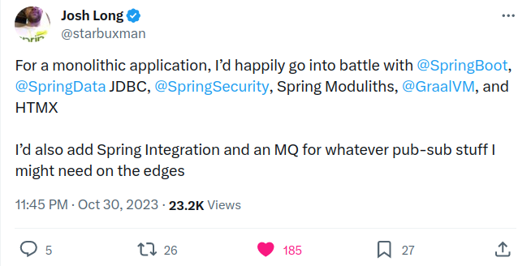

# The tweet that started this thing

ATM the code is basically Oliver Drotbohms [Modulith Example](https://github.com/spring-projects/spring-modulith/tree/main/spring-modulith-examples) in Kotlin,
but with my favorite example domain: Dungeons and Dragons!

# Motivation

I want to explore Moduliths and keep my Spring skills sharp. 

### Reference Documentation
For further reference, please consider the following sections:

* [Official Gradle documentation](https://docs.gradle.org)
* [Spring Boot Gradle Plugin Reference Guide](https://docs.spring.io/spring-boot/docs/3.1.5/gradle-plugin/reference/html/)
* [Create an OCI image](https://docs.spring.io/spring-boot/docs/3.1.5/gradle-plugin/reference/html/#build-image)
* [Spring Web](https://docs.spring.io/spring-boot/docs/3.1.5/reference/htmlsingle/index.html#web)
* [Thymeleaf](https://docs.spring.io/spring-boot/docs/3.1.5/reference/htmlsingle/index.html#web.servlet.spring-mvc.template-engines)
* [Spring Security](https://docs.spring.io/spring-boot/docs/3.1.5/reference/htmlsingle/index.html#web.security)
* [Spring Data JDBC](https://docs.spring.io/spring-boot/docs/3.1.5/reference/htmlsingle/index.html#data.sql.jdbc)
* [Flyway Migration](https://docs.spring.io/spring-boot/docs/3.1.5/reference/htmlsingle/index.html#howto.data-initialization.migration-tool.flyway)
* [Spring Modulith](https://docs.spring.io/spring-modulith/docs/current/reference/html/)

### Guides
The following guides illustrate how to use some features concretely:

* [Building a RESTful Web Service](https://spring.io/guides/gs/rest-service/)
* [Serving Web Content with Spring MVC](https://spring.io/guides/gs/serving-web-content/)
* [Building REST services with Spring](https://spring.io/guides/tutorials/rest/)
* [Handling Form Submission](https://spring.io/guides/gs/handling-form-submission/)
* [Securing a Web Application](https://spring.io/guides/gs/securing-web/)
* [Spring Boot and OAuth2](https://spring.io/guides/tutorials/spring-boot-oauth2/)
* [Authenticating a User with LDAP](https://spring.io/guides/gs/authenticating-ldap/)
* [Using Spring Data JDBC](https://github.com/spring-projects/spring-data-examples/tree/master/jdbc/basics)

### Additional Links
These additional references should also help you:

* [Gradle Build Scans – insights for your project's build](https://scans.gradle.com#gradle)

